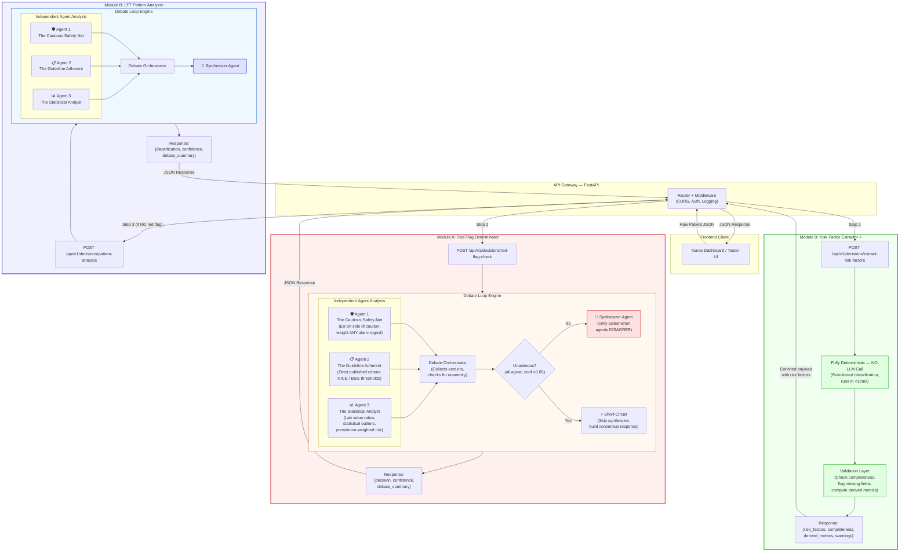
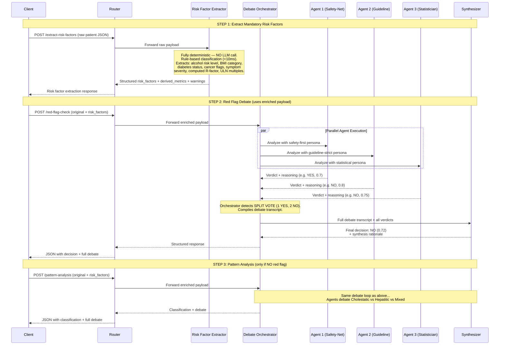

# AI Debate Loop Architecture — Nurse-Led Abnormal LFT Clinic

## Overview

This document defines the backend architecture for the **three-stage clinical decision pipeline**
in the Nurse-Led Abnormal LFT Clinic workflow. Stage 1 extracts mandatory risk factors from
raw patient data. Stages 2 and 3 use **Multi-Agent Debate Loops** to produce transparent,
explainable clinical reasoning for triage decisions.

---

## 1. High-Level Architecture Diagram



---

## 2. Full Pipeline Sequence — Extract → Debate → Classify



---

## 3. API Design Specifications

### 3.1 Common Request Body Schema

All three endpoints accept the same base input payload (Module A and B also receive the enriched `risk_factors` from Module 0):

```yaml
PatientPayload:
  type: object
  required: [scenario_id, patient_demographics, referral_summary, lft_blood_results, history_risk_factors]
  properties:
    scenario_id:
      type: string
      example: "sc_05_no_rf_mixed_debate"
    patient_demographics:
      type: object
      properties:
        age: { type: integer }
        sex: { type: string, enum: [male, female] }
    referral_summary:
      type: object
      properties:
        symptoms: { type: array, items: { type: string } }
        urgency_requested: { type: string, enum: [immediate, urgent, routine] }
    lft_blood_results:
      type: object
      properties:
        ALT_IU_L:        { type: number }
        AST_IU_L:        { type: number }
        ALP_IU_L:        { type: number }
        Bilirubin_umol_L: { type: number }
        Albumin_g_L:      { type: number }
        GGT_IU_L:        { type: number }
    history_risk_factors:
      type: object
      properties:
        alcohol_units_weekly: { type: number }
        bmi:                  { type: number }
        known_liver_disease:  { type: boolean }
        comorbidities:        { type: array, items: { type: string } }
```

---

### 3.2 Module 0: Risk Factor Extractor

**`POST /api/v1/decisions/extract-risk-factors`**

This is **not** a debate — it's a **fully deterministic module with NO LLM call**. All risk
factor classifications use rule-based threshold logic. Derived metrics are computed
mathematically. Runs in <10ms.

#### Why This Step Exists

Raw patient JSON contains unstructured symptoms, raw lab numbers, and free-text comorbidities.
Before agents can debate meaningfully, the system must:

1. **Classify risk levels** — Is 18 units/week alcohol "moderate" or "high"? Is BMI 36.5 "obese" or "morbidly obese"?
2. **Compute derived metrics** — R-factor, ULN multiples, AST:ALT ratio, De Ritis ratio
3. **Flag key clinical signals** — Cancer history present? Jaundice mentioned? Diabetes status?
4. **Check completeness** — Are any mandatory fields missing that could undermine the debate?

Without this, each agent would independently interpret raw values, potentially using different
thresholds — leading to inconsistent debates.

#### Response Body Schema

```yaml
RiskFactorResponse:
  type: object
  properties:
    scenario_id:
      type: string
    module:
      type: string
      enum: [risk_factor_extractor]
    timestamp:
      type: string
      format: date-time
    completeness:
      type: object
      properties:
        score:
          type: number
          minimum: 0.0
          maximum: 1.0
          description: "1.0 = all mandatory fields present"
        missing_fields:
          type: array
          items: { type: string }
          description: "Fields that are absent or invalid"
        warnings:
          type: array
          items: { type: string }
          description: "Data quality warnings (e.g. 'BMI seems unusually high')"
    risk_factors:
      type: object
      properties:
        alcohol_risk:
          type: object
          properties:
            units_weekly: { type: number }
            level: { type: string, enum: [none, low, moderate, high, very_high] }
            exceeds_guidelines: { type: boolean }
        bmi_category:
          type: object
          properties:
            value: { type: number }
            category: { type: string, enum: [underweight, normal, overweight, obese, morbidly_obese] }
        diabetes_status:
          type: object
          properties:
            present: { type: boolean }
            type: { type: string, enum: [none, type_1, type_2, gestational, unspecified] }
        cancer_history:
          type: object
          properties:
            present: { type: boolean }
            types: { type: array, items: { type: string } }
            metastasis_risk: { type: string, enum: [none, low, moderate, high] }
        symptom_severity:
          type: object
          properties:
            has_red_flag_symptoms: { type: boolean }
            jaundice: { type: boolean }
            weight_loss: { type: boolean }
            abdominal_mass: { type: boolean }
            dark_urine_pale_stools: { type: boolean }
            pain_severity: { type: string, enum: [none, mild, moderate, severe] }
            symptom_list:
              type: array
              items: { type: string }
        liver_disease_history:
          type: object
          properties:
            known_disease: { type: boolean }
            details: { type: string }
    derived_metrics:
      type: object
      properties:
        r_factor:
          type: object
          properties:
            value: { type: number }
            formula: { type: string }
            zone: { type: string, enum: [cholestatic, mixed, hepatitic] }
        uln_multiples:
          type: object
          description: "Each lab value as a multiple of Upper Limit of Normal"
          properties:
            ALT: { type: number }
            AST: { type: number }
            ALP: { type: number }
            Bilirubin: { type: number }
            GGT: { type: number }
        ast_alt_ratio:
          type: object
          properties:
            value: { type: number }
            interpretation: { type: string }
        albumin_status:
          type: string
          enum: [normal, low_normal, low, critically_low]
        overall_lab_severity:
          type: string
          enum: [normal, mildly_elevated, moderately_elevated, severely_elevated, critical]
    processing_metadata:
      type: object
      properties:
        model_used: { type: string }
        processing_time_ms: { type: integer }
        token_usage: { type: object }
```

#### Example Response (Scenario 5)

```json
{
  "scenario_id": "sc_05_no_rf_mixed_debate",
  "module": "risk_factor_extractor",
  "timestamp": "2026-03-12T15:42:05Z",
  "completeness": {
    "score": 1.0,
    "missing_fields": [],
    "warnings": [
      "BMI 36.5 is in morbidly obese range — verify measurement accuracy",
      "Alcohol intake at 18 units/week exceeds UK guideline of 14 units"
    ]
  },
  "risk_factors": {
    "alcohol_risk": {
      "units_weekly": 18,
      "level": "moderate",
      "exceeds_guidelines": true
    },
    "bmi_category": {
      "value": 36.5,
      "category": "morbidly_obese"
    },
    "diabetes_status": {
      "present": true,
      "type": "type_2"
    },
    "cancer_history": {
      "present": false,
      "types": [],
      "metastasis_risk": "none"
    },
    "symptom_severity": {
      "has_red_flag_symptoms": false,
      "jaundice": false,
      "weight_loss": false,
      "abdominal_mass": false,
      "dark_urine_pale_stools": false,
      "pain_severity": "none",
      "symptom_list": ["asymptomatic — routine diabetic checkup"]
    },
    "liver_disease_history": {
      "known_disease": false,
      "details": "none"
    }
  },
  "derived_metrics": {
    "r_factor": {
      "value": 2.17,
      "formula": "(ALT/ULN) / (ALP/ULN) = (140/40) / (210/130) = 3.5 / 1.615",
      "zone": "mixed"
    },
    "uln_multiples": {
      "ALT": 3.5,
      "AST": 2.75,
      "ALP": 1.62,
      "Bilirubin": 1.5,
      "GGT": 3.6
    },
    "ast_alt_ratio": {
      "value": 0.79,
      "interpretation": "AST:ALT <1.0 — suggests NAFLD over alcoholic liver disease"
    },
    "albumin_status": "low_normal",
    "overall_lab_severity": "moderately_elevated"
  },
  "processing_metadata": {
    "model_used": "gemini-2.5-flash",
    "processing_time_ms": 1200,
    "token_usage": { "input": 650, "output": 400, "total": 1050 }
  }
}
```

---

### 3.3 Module A: Red Flag Determinator

**`POST /api/v1/decisions/red-flag-check`**

#### Response Body Schema

```yaml
RedFlagResponse:
  type: object
  properties:
    scenario_id:
      type: string
    module:
      type: string
      enum: [red_flag_determinator]
    timestamp:
      type: string
      format: date-time
    final_decision:
      type: string
      enum: [RED_FLAG_PRESENT, NO_RED_FLAG]
    confidence_score:
      type: number
      minimum: 0.0
      maximum: 1.0
    recommended_action:
      type: string
      description: "Plain-language next step for the nurse"
    debate_summary:
      type: object
      properties:
        consensus_reached:
          type: boolean
        vote_tally:
          type: object
          properties:
            red_flag_present: { type: integer }
            no_red_flag: { type: integer }
        key_arguments_for_red_flag:
          type: array
          items: { type: string }
        key_arguments_against_red_flag:
          type: array
          items: { type: string }
        key_contention_points:
          type: array
          items: { type: string }
        synthesis_rationale:
          type: string
          description: "The Synthesizer's reasoning for the final decision"
        agent_perspectives:
          type: array
          items:
            type: object
            properties:
              agent_id: { type: string }
              agent_persona: { type: string }
              verdict: { type: string }
              confidence: { type: number }
              reasoning: { type: string }
              key_factors_cited:
                type: array
                items: { type: string }
    processing_metadata:
      type: object
      properties:
        model_used: { type: string }
        total_agents: { type: integer }
        debate_rounds: { type: integer }
        processing_time_ms: { type: integer }
```

---

### 3.4 Module B: LFT Pattern Analyzer

**`POST /api/v1/decisions/pattern-analysis`**

#### Response Body Schema

```yaml
PatternAnalysisResponse:
  type: object
  properties:
    scenario_id:
      type: string
    module:
      type: string
      enum: [lft_pattern_analyzer]
    timestamp:
      type: string
      format: date-time
    final_classification:
      type: string
      enum: [CHOLESTATIC, HEPATITIC, MIXED]
    confidence_score:
      type: number
      minimum: 0.0
      maximum: 1.0
    r_factor:
      type: object
      description: "The computed R-factor used in pattern classification"
      properties:
        value: { type: number }
        formula: { type: string }
        interpretation: { type: string }
    recommended_action:
      type: string
    debate_summary:
      type: object
      properties:
        consensus_reached:
          type: boolean
        vote_tally:
          type: object
          properties:
            cholestatic: { type: integer }
            hepatitic: { type: integer }
            mixed: { type: integer }
        key_arguments_for_primary:
          type: array
          items: { type: string }
        key_arguments_against_primary:
          type: array
          items: { type: string }
        key_contention_points:
          type: array
          items: { type: string }
        synthesis_rationale:
          type: string
        agent_perspectives:
          type: array
          items:
            type: object
            properties:
              agent_id: { type: string }
              agent_persona: { type: string }
              classification: { type: string }
              confidence: { type: number }
              reasoning: { type: string }
              key_factors_cited:
                type: array
                items: { type: string }
    processing_metadata:
      type: object
      properties:
        model_used: { type: string }
        total_agents: { type: integer }
        debate_rounds: { type: integer }
        processing_time_ms: { type: integer }
```

---

## 4. Example API Interaction — Scenario 5 (Mixed Pattern Debate)

### Step 1: Request to Module 0 (Risk Factor Extraction)

```
POST /api/v1/decisions/extract-risk-factors
Content-Type: application/json
```

```json
{
  "scenario_id": "sc_05_no_rf_mixed_debate",
  "patient_demographics": { "age": 51, "sex": "male" },
  "referral_summary": {
    "symptoms": ["none", "routine diabetic checkup"],
    "urgency_requested": "routine"
  },
  "lft_blood_results": {
    "ALT_IU_L": 140,
    "AST_IU_L": 110,
    "ALP_IU_L": 210,
    "Bilirubin_umol_L": 30,
    "Albumin_g_L": 39,
    "GGT_IU_L": 180
  },
  "history_risk_factors": {
    "alcohol_units_weekly": 18,
    "bmi": 36.5,
    "known_liver_disease": false,
    "comorbidities": ["Type 2 Diabetes", "Hypertension"]
  }
}
```

### Step 2: Response from Module 0

*(See the full example response in Section 3.2 above)*

Key extractions:
- `alcohol_risk.level`: "moderate", `exceeds_guidelines`: true
- `bmi_category`: "morbidly_obese"
- `diabetes_status`: type_2
- `symptom_severity.has_red_flag_symptoms`: false
- `r_factor`: 2.17 (mixed zone)
- `ast_alt_ratio`: 0.79 → suggests NAFLD over alcoholic
- `overall_lab_severity`: "moderately_elevated"

### Step 3: Request to Module A (Red Flag Check)

The original patient payload is now **enriched** with the `risk_factors` and `derived_metrics`
from Module 0, so the debate agents don't need to independently compute these values.

```
POST /api/v1/decisions/red-flag-check
Content-Type: application/json
```

```json
{
  "scenario_id": "sc_05_no_rf_mixed_debate",
  "patient_demographics": { "age": 51, "sex": "male" },
  "referral_summary": {
    "symptoms": ["none", "routine diabetic checkup"],
    "urgency_requested": "routine"
  },
  "lft_blood_results": {
    "ALT_IU_L": 140, "AST_IU_L": 110, "ALP_IU_L": 210,
    "Bilirubin_umol_L": 30, "Albumin_g_L": 39, "GGT_IU_L": 180
  },
  "history_risk_factors": {
    "alcohol_units_weekly": 18, "bmi": 36.5,
    "known_liver_disease": false,
    "comorbidities": ["Type 2 Diabetes", "Hypertension"]
  },
  "risk_factors": {
    "alcohol_risk": { "level": "moderate", "exceeds_guidelines": true },
    "bmi_category": { "value": 36.5, "category": "morbidly_obese" },
    "diabetes_status": { "present": true, "type": "type_2" },
    "cancer_history": { "present": false, "metastasis_risk": "none" },
    "symptom_severity": { "has_red_flag_symptoms": false, "jaundice": false, "weight_loss": false, "pain_severity": "none" },
    "liver_disease_history": { "known_disease": false }
  },
  "derived_metrics": {
    "r_factor": { "value": 2.17, "zone": "mixed" },
    "uln_multiples": { "ALT": 3.5, "AST": 2.75, "ALP": 1.62, "Bilirubin": 1.5, "GGT": 3.6 },
    "ast_alt_ratio": { "value": 0.79, "interpretation": "NAFLD > alcoholic" },
    "albumin_status": "low_normal",
    "overall_lab_severity": "moderately_elevated"
  }
}
```

### Step 4: Response from Module A

```json
{
  "scenario_id": "sc_05_no_rf_mixed_debate",
  "module": "red_flag_determinator",
  "timestamp": "2026-03-12T15:42:08Z",
  "final_decision": "NO_RED_FLAG",
  "confidence_score": 0.82,
  "recommended_action": "No urgent pathway required. Proceed to routine LFT pattern analysis.",
  "debate_summary": {
    "consensus_reached": true,
    "vote_tally": {
      "red_flag_present": 0,
      "no_red_flag": 3
    },
    "key_arguments_for_red_flag": [
      "Bilirubin at 30 µmol/L is mildly elevated — warrants monitoring but not red-flag threshold (typically >50 µmol/L with symptoms).",
      "Combination of metabolic syndrome (obesity, T2DM, hypertension) with 18 units/week alcohol creates a multi-hit liver risk profile."
    ],
    "key_arguments_against_red_flag": [
      "Patient is asymptomatic — presenting for routine diabetic checkup only, no pain, no jaundice, no weight loss.",
      "No classic red-flag symptoms: no painless jaundice, no palpable mass, no dark urine/pale stools.",
      "Urgency requested by GP is 'routine', indicating low clinical suspicion.",
      "Albumin at 39 g/L is within acceptable range — no evidence of hepatic synthetic failure.",
      "No known cancer history or prior liver disease to raise index of suspicion."
    ],
    "key_contention_points": [
      "Agent 1 noted the cumulative metabolic risk (obesity + diabetes + alcohol) deserves heightened vigilance, though not red-flag classification. Agents 2 and 3 agreed this is managed in the routine pathway."
    ],
    "synthesis_rationale": "All three agents agree unanimously: no red-flag symptoms are present. The patient is asymptomatic with routine referral. While the metabolic risk factors (BMI 36.5, T2DM, moderate alcohol use) are clinically significant, they represent chronic risk factors managed through the standard LFT assessment pathway, not acute red-flag indicators. Bilirubin elevation is mild and isolated. Proceeding to LFT pattern analysis is appropriate.",
    "agent_perspectives": [
      {
        "agent_id": "agent_safety_net",
        "agent_persona": "The Cautious Safety-Net",
        "verdict": "NO_RED_FLAG",
        "confidence": 0.75,
        "reasoning": "No acute symptoms. However, the triple-hit of obesity (BMI 36.5), diabetes, and 18 units/week alcohol makes this patient a ticking time bomb for progressive liver disease. I would not flag this as 'red flag' but I want it noted that this patient needs close follow-up regardless of LFT pattern outcome.",
        "key_factors_cited": [
          "No jaundice or weight loss",
          "BMI 36.5 + T2DM + alcohol = high cumulative risk",
          "Bilirubin 30 mildly elevated but sub-threshold"
        ]
      },
      {
        "agent_id": "agent_guideline",
        "agent_persona": "The Guideline Adherent",
        "verdict": "NO_RED_FLAG",
        "confidence": 0.88,
        "reasoning": "Per NICE CG100 and BSG guidelines, red flags for urgent hepatology referral include: painless jaundice with weight loss, palpable abdominal mass, suspected variceal bleeding, or encephalopathy. None of these are present. The abnormal LFTs in the absence of red-flag symptoms should proceed through the standard assessment algorithm starting with pattern classification.",
        "key_factors_cited": [
          "NICE CG100 red-flag criteria not met",
          "No jaundice, mass, bleeding, or encephalopathy",
          "Routine referral from GP"
        ]
      },
      {
        "agent_id": "agent_statistician",
        "agent_persona": "The Statistical Analyst",
        "verdict": "NO_RED_FLAG",
        "confidence": 0.85,
        "reasoning": "Statistical analysis: Bilirubin 30 µmol/L is 1.5x upper limit of normal (ULN=20) — insufficient for red-flag threshold which typically requires >3x ULN with symptoms. ALT 140 is ~3.5x ULN, AST 110 is ~2.8x ULN — elevated but in the moderate range seen in NAFLD/alcohol-related liver injury, not acute hepatitis territory (>10x ULN). The lab profile is consistent with chronic metabolic/alcohol-related elevation, not an acute emergency.",
        "key_factors_cited": [
          "Bilirubin 1.5x ULN — below red-flag threshold",
          "ALT/AST 3-4x ULN — moderate, not acute",
          "Pattern consistent with chronic metabolic aetiology"
        ]
      }
    ]
  },
  "processing_metadata": {
    "model_used": "gemini-2.5-flash",
    "total_agents": 3,
    "debate_rounds": 1,
    "processing_time_ms": 4200
  }
}
```

### Step 5: Request to Module B (Pattern Analysis)

Since Module A returned `NO_RED_FLAG`, the enriched payload (with `risk_factors` and
`derived_metrics`) is sent to Module B:

```
POST /api/v1/decisions/pattern-analysis
Content-Type: application/json
```

*(Same enriched JSON payload as Step 3 — original data + risk_factors + derived_metrics)*

### Step 6: Response from Module B (The Heated Debate)

```json
{
  "scenario_id": "sc_05_no_rf_mixed_debate",
  "module": "lft_pattern_analyzer",
  "timestamp": "2026-03-12T15:42:14Z",
  "final_classification": "MIXED",
  "confidence_score": 0.62,
  "r_factor": {
    "value": 2.22,
    "formula": "(ALT / ALT_ULN) / (ALP / ALP_ULN) = (140/40) / (210/130) = 3.5 / 1.615 = 2.17",
    "interpretation": "R-factor between 2 and 5 falls in the MIXED zone. Values <2 suggest cholestatic, >5 suggest hepatitic. This value at 2.17 sits right at the lower boundary of mixed, dangerously close to cholestatic territory."
  },
  "recommended_action": "Mixed LFT pattern identified. Recommend comprehensive workup: hepatitis B/C serology, liver ultrasound, fasting lipids, HbA1c review, and consideration of FibroScan given metabolic risk profile. Refer to hepatologist for further evaluation.",
  "debate_summary": {
    "consensus_reached": false,
    "vote_tally": {
      "cholestatic": 0,
      "hepatitic": 1,
      "mixed": 2
    },
    "key_arguments_for_primary": [
      "R-factor of 2.17 is technically in the mixed range (2-5), making MIXED the classification by mathematical definition.",
      "Both hepatocellular markers (ALT 140, AST 110) AND cholestatic markers (ALP 210, GGT 180) are significantly elevated — no single axis dominates clearly.",
      "The clinical picture — obesity, diabetes, alcohol — can cause BOTH steatohepatitis (hepatitic) AND biliary steatosis/cholestasis, supporting a genuinely mixed aetiology."
    ],
    "key_arguments_against_primary": [
      "Agent 3 argued hepatitic: ALT is 3.5x ULN vs ALP at only 1.6x ULN — the hepatocellular damage is proportionally much greater.",
      "AST:ALT ratio of 0.79 (<1.0) points toward non-alcoholic fatty liver disease (NAFLD) rather than pure alcohol damage, which typically shows AST>ALT.",
      "In morbidly obese patients with T2DM, NAFLD/NASH is by far the most common diagnosis — this clinical context should shift classification toward hepatitic."
    ],
    "key_contention_points": [
      "The R-factor of 2.17 is on the knife-edge between mixed and cholestatic. Agent 2 argued the mathematical boundary must be respected. Agent 3 argued that clinical context (obesity, diabetes) should override borderline math in favour of hepatitic.",
      "Agent 1 raised concern that GGT 180 (elevated) could indicate biliary involvement or enzyme induction from alcohol — either interpretation supports mixed over pure hepatitic.",
      "Debate about whether BMI 36.5 with T2DM makes hepatitic a near-certainty vs. whether the ALP/GGT elevation indicates a secondary cholestatic process running in parallel."
    ],
    "synthesis_rationale": "This is a genuinely borderline case. The R-factor at 2.17 technically places this in the mixed zone by BSG classification criteria, and I am giving weight to that mathematical boundary. However, the clinical context strongly suggests NAFLD/NASH as the primary driver, which is hepatocellular in nature. The reason I am not overriding to 'hepatitic' is that the ALP (210, 1.6x ULN) and GGT (180) elevations are not trivial — they suggest either a secondary cholestatic process, biliary steatosis, or alcohol-related enzyme induction running concurrently. A classification of MIXED appropriately triggers a broader workup that investigates BOTH axes, which is the safest clinical path. Confidence is moderate (0.62) because a reasonable hepatologist could justifiably classify this as hepatitic-predominant. I recommend the downstream workup include both hepatitis serology AND biliary imaging.",
    "agent_perspectives": [
      {
        "agent_id": "agent_safety_net",
        "agent_persona": "The Cautious Safety-Net",
        "classification": "MIXED",
        "confidence": 0.65,
        "reasoning": "When in doubt, cast the wider net. The R-factor is borderline and the clinical picture is complex with multiple overlapping aetiologies (NAFLD, possible alcohol-related, possible cholestatic component). Classifying as MIXED triggers investigations on both the hepatocellular and cholestatic axes. Classifying as purely hepatitic might cause us to under-investigate the ALP/GGT elevation. In a patient with this many metabolic risk factors, missing a concurrent cholestatic process would be an error.",
        "key_factors_cited": [
          "R-factor 2.17 — technically mixed zone",
          "ALP 210 and GGT 180 not trivially elevated",
          "Multiple overlapping aetiologies possible",
          "Wider workup is safer than narrow"
        ]
      },
      {
        "agent_id": "agent_guideline",
        "agent_persona": "The Guideline Adherent",
        "classification": "MIXED",
        "confidence": 0.70,
        "reasoning": "The BSG guidelines define the R-factor thresholds as: <2 = cholestatic, 2-5 = mixed, >5 = hepatitic. The calculated R-factor is 2.17, which falls within the defined mixed range. Guideline-adherent classification is MIXED. The guidelines exist precisely for borderline cases like this — they prevent subjective over-interpretation. The recommended workup for mixed pattern per BSG includes hepatitis serology, autoimmune screen, liver ultrasound, and clinical review.",
        "key_factors_cited": [
          "BSG R-factor definition: 2-5 = mixed",
          "R-factor 2.17 is within mixed range",
          "Guidelines prevent subjective override",
          "Mixed workup protocol covers both axes"
        ]
      },
      {
        "agent_id": "agent_statistician",
        "agent_persona": "The Statistical Analyst",
        "classification": "HEPATITIC",
        "confidence": 0.60,
        "reasoning": "While the R-factor of 2.17 technically falls in the mixed zone, I argue for clinical context adjustment. Statistically: ALT is 3.5x ULN but ALP is only 1.6x ULN — the magnitude of hepatocellular elevation is disproportionately greater. The probability of NAFLD in a 51-year-old male with BMI 36.5, T2DM, and 18u/week alcohol exceeds 85% based on epidemiological data. NAFLD/NASH is overwhelmingly a hepatocellular disease. The GGT elevation is more likely driven by enzyme induction from alcohol and metabolic syndrome rather than true cholestasis. The ALP elevation at 1.6x ULN is modest and can be seen in NAFLD without biliary pathology. I believe strict adherence to the R-factor boundary at 2.17 leads to over-classification as mixed when the clinical picture overwhelmingly points to hepatitic aetiology.",
        "key_factors_cited": [
          "ALT 3.5x ULN vs ALP 1.6x ULN — disproportionate hepatocellular dominance",
          "BMI 36.5 + T2DM → >85% pre-test probability of NAFLD",
          "AST:ALT ratio <1 supports NAFLD over alcohol",
          "GGT elevation likely from enzyme induction, not cholestasis",
          "R-factor 2.17 is at extreme lower boundary of mixed"
        ]
      }
    ]
  },
  "processing_metadata": {
    "model_used": "gemini-2.5-flash",
    "total_agents": 3,
    "debate_rounds": 1,
    "processing_time_ms": 5800
  }
}
```

---

## 5. Agent Persona Definitions

### Agent 1: The Cautious Safety-Net
- **Philosophy:** When in doubt, choose the safer path. Would rather over-investigate than miss a diagnosis.
- **Bias:** Tends toward RED_FLAG and MIXED classifications.
- **Strength:** Catches edge cases other agents dismiss.

### Agent 2: The Guideline Adherent
- **Philosophy:** Strict adherence to published clinical guidelines (NICE, BSG, EASL). If the guideline says X, classify as X.
- **Bias:** Follows thresholds literally; won't override with clinical judgement.
- **Strength:** Reproducible, defensible, audit-friendly decisions.

### Agent 3: The Statistical Analyst
- **Philosophy:** Numbers don't lie. Uses ratios, multiples of ULN, prevalence data, and Bayesian reasoning.
- **Bias:** May override guideline boundaries when statistical evidence is strong.
- **Strength:** Catches cases where rigid thresholds lead to misclassification.

### Synthesizer Agent
- **Philosophy:** Weighs all three perspectives. Defaults to majority vote but can override if a minority argument is clinically compelling.
- **Output:** Final decision, confidence score, and written rationale explaining how the decision was reached.

---

## 6. Module Directory Structure

```
backend/
├── debate_engine/
│   ├── __init__.py
│   ├── config.py              # Debate engine config (model, personas, thresholds)
│   ├── schemas.py             # Pydantic models for request/response
│   ├── agents/
│   │   ├── __init__.py
│   │   ├── base.py            # BaseAgent class
│   │   ├── safety_net.py      # The Cautious Safety-Net
│   │   ├── guideline.py       # The Guideline Adherent
│   │   └── statistician.py    # The Statistical Analyst
│   ├── orchestrator.py        # Runs agents in parallel, compiles debate
│   ├── synthesizer.py         # Final verdict from debate transcript
│   ├── modules/
│   │   ├── __init__.py
│   │   ├── risk_factor_extractor.py  # Module 0: Extract & compute risk factors
│   │   ├── red_flag.py               # Module A: Red Flag Determinator
│   │   └── pattern_analysis.py       # Module B: LFT Pattern Analyzer
│   ├── rate_limiter.py        # Token budget & request rate limiting
│   └── prompts/
│       ├── risk_factor_extraction.md
│       ├── red_flag_safety_net.md
│       ├── red_flag_guideline.md
│       ├── red_flag_statistician.md
│       ├── red_flag_synthesizer.md
│       ├── pattern_safety_net.md
│       ├── pattern_guideline.md
│       ├── pattern_statistician.md
│       └── pattern_synthesizer.md
├── app/
│   └── api/
│       └── routes/
│           └── decisions.py   # FastAPI route: /api/v1/decisions/*
```

---

## 7. Rate Limiting & Token Budget Management

After performance optimizations, the pipeline makes **0 + 3-4 + 3-4 = 6-8 LLM calls**
(Module 0 is deterministic, debate modules use 3 agents + 1 synthesizer only when agents disagree).

### 7.1 Performance Optimizations

Three optimizations reduce end-to-end time from ~5+ minutes to ~2-3 minutes:

1. **Deterministic Module 0** — Risk factor extraction uses rule-based classification with
   no LLM call. Runs in <10ms instead of ~90 seconds. Saves ~90s.

2. **Thinking disabled for agents** — `gemini-2.5-flash` thinking tokens consume from the
   output budget and add latency. Agents have specific-enough prompts that thinking is
   unnecessary. `thinking_budget: 0` for agents, small budget (1024) only for synthesizer
   when resolving disagreements. Saves ~30-60s per debate module.

3. **Unanimous short-circuit** — If all 3 agents agree with >0.85 confidence, the
   synthesizer is skipped entirely. A lightweight consensus response is built from the
   agent outputs. Saves ~30-60s on clear-cut scenarios (e.g., SC-01 critical red flag,
   SC-03/04 clear patterns).

### 7.2 Token Budget Per Request

| Component | Est. Input Tokens | Est. Output Tokens | Total |
|-----------|------------------:|-------------------:|------:|
| **Module 0** (deterministic) | 0 | 0 | **0** |
| Agent prompt + enriched payload | ~900 | ~300 | ~1,200 |
| x3 agents per debate module | — | — | ~3,600 |
| Synthesizer (only if disagreement) | ~2,000 | ~500 | ~2,500 |
| **Total per debate module (disagreement)** | — | — | **~6,100** |
| **Total per debate module (unanimous)** | — | — | **~3,600** |
| **Full workflow (best case — both unanimous)** | — | — | **~7,200** |
| **Full workflow (worst case — both debated)** | — | — | **~12,200** |

### 7.3 Rate Limiting Strategy

```python
# debate_engine/rate_limiter.py

RATE_LIMITS = {
    # Per-user / per-session limits
    "max_requests_per_minute": 5,        # Max 5 debate requests per minute
    "max_requests_per_hour": 30,         # Max 30 per hour
    "max_requests_per_day": 200,         # Daily cap

    # Token budget controls
    "max_input_tokens_per_agent": 1500,  # Truncate if prompt exceeds this
    "max_output_tokens_per_agent": 600,  # Cap agent response length
    "max_output_tokens_synthesizer": 800,# Synthesizer gets slightly more
    "daily_token_budget": 500_000,       # Global daily token ceiling

    # Circuit breaker
    "consecutive_failure_threshold": 3,  # After 3 failures, pause 60s
    "circuit_breaker_cooldown_sec": 60,
}
```

### 7.4 Implementation Approach

1. **Request-level rate limiting** — Use FastAPI middleware with `slowapi` or a custom
   in-memory counter (keyed by IP or session). Return `429 Too Many Requests` when exceeded.

2. **Token budget tracking** — Track cumulative tokens per day in a lightweight store
   (Redis or in-memory dict). Each Gemini response returns `usage_metadata` with
   `prompt_token_count` and `candidates_token_count` — accumulate these.

3. **Per-agent output caps** — Set `max_output_tokens` in each Gemini `generate_content`
   call to prevent runaway responses (e.g., an agent writing a 2000-token essay).

4. **Prompt compression** — Keep prompts lean by using markdown-formatted prompt files
   (`.md`) with structured sections. Avoid repeating the full patient payload in the
   synthesizer prompt — pass only agent verdicts and key reasoning, not raw data.

5. **Short-circuit on unanimous early rounds** — If all 3 agents agree with >0.85
   confidence, skip the synthesizer's deep analysis and return a lightweight consensus
   response. This saves ~2,600 tokens per unanimous decision.

### 7.5 Response Metadata for Token Transparency

Every API response includes token usage in `processing_metadata`:

```json
{
  "processing_metadata": {
    "model_used": "gemini-2.5-flash",
    "total_agents": 3,
    "debate_rounds": 1,
    "processing_time_ms": 4200,
    "token_usage": {
      "total_input_tokens": 4100,
      "total_output_tokens": 2100,
      "total_tokens": 6200,
      "breakdown": {
        "agent_safety_net": { "input": 820, "output": 380 },
        "agent_guideline": { "input": 820, "output": 350 },
        "agent_statistician": { "input": 820, "output": 410 },
        "synthesizer": { "input": 1640, "output": 560 }
      }
    },
    "daily_budget_remaining": 487600
  }
}
```
